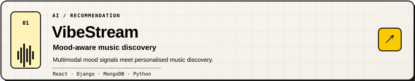
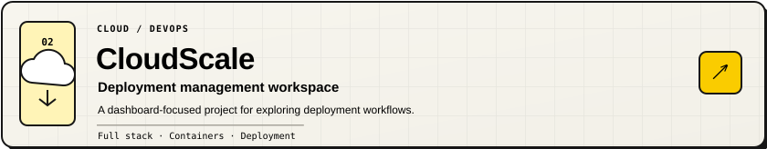
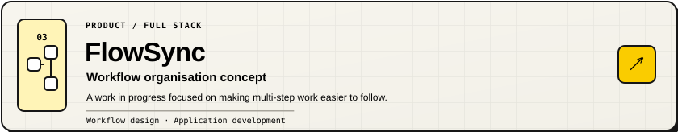

<picture><source media="(prefers-color-scheme: dark)" srcset="assets/hero-dark.svg" /></picture>

<a href="https://github.com/JainMehul05?tab=repositories"><picture><source media="(prefers-color-scheme: dark)" srcset="assets/btn-site-dark.svg" /></picture></a>
<a href="https://github.com/JainMehul05?tab=repositories"><picture><source media="(prefers-color-scheme: dark)" srcset="assets/btn-resume-dark.svg" /></picture></a>
<a href="https://linkedin.com/in/jainmehul05"><picture><source media="(prefers-color-scheme: dark)" srcset="assets/btn-linkedin-dark.svg" /></picture></a>
<a href="mailto:mjain3_be24@thapar.edu"><picture><source media="(prefers-color-scheme: dark)" srcset="assets/btn-email-dark.svg" /></picture></a>
<picture><source media="(prefers-color-scheme: dark)" srcset="assets/btn-views-dark.svg" /></picture>

I'm Mehul, a Computer Science Engineering student at Thapar. I like building end-to-end software, exploring AI-powered experiences, and learning how reliable systems are put together.

 

<picture><source media="(prefers-color-scheme: dark)" srcset="assets/work-head-dark.svg" /></picture>
<a href="https://github.com/JainMehul05?tab=repositories"><picture><source media="(prefers-color-scheme: dark)" srcset="assets/work-vibestream-dark.svg" /></picture></a>
<a href="https://github.com/JainMehul05?tab=repositories"><picture><source media="(prefers-color-scheme: dark)" srcset="assets/work-cloudscale-dark.svg" /></picture></a>
<a href="https://github.com/JainMehul05?tab=repositories"><picture><source media="(prefers-color-scheme: dark)" srcset="assets/work-flowsync-dark.svg" /></picture></a>

 

<picture><source media="(prefers-color-scheme: dark)" srcset="assets/stack-dark.svg" /></picture>

  

<a href="mailto:mjain3_be24@thapar.edu"><picture><source media="(prefers-color-scheme: dark)" srcset="assets/footer-dark.svg" /></picture></a>
