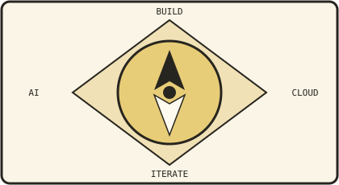
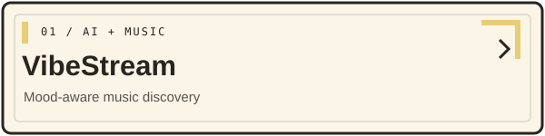
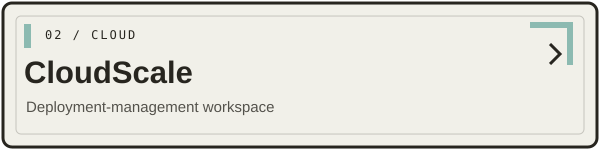
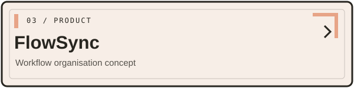
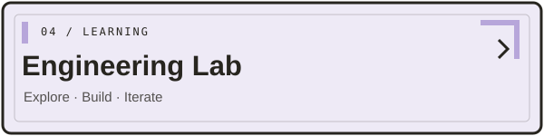

 

---

<table>
<tr>
<td width="58%" valign="top">

## 01 — About

I'm **Mehul Jain**, a Computer Science Engineering student at **Thapar Institute of Engineering & Technology**. I enjoy building at the intersection of product engineering, AI, and infrastructure.

My approach is to understand the whole system: the interface people use, the APIs behind it, the data it relies on, and the infrastructure that runs it.

- Building full-stack applications and practical product experiences
- Exploring AI-powered applications and recommendation systems
- Learning cloud infrastructure, containers, CI/CD, and system design
- Interested in internships across **Full Stack, AI Engineering, and Cloud/DevOps**

</td>
<td width="42%" valign="top">

## Current direction

**Build. Understand. Improve.**

I learn by implementing ideas, testing assumptions, and iterating on the result.

</td>
</tr>
</table>

---

## 02 — Selected work

<table>
<tr>
<td width="50%" valign="top">

### VibeStream
**Mood-aware music discovery**

An AI-assisted music discovery project exploring how mood can influence recommendations. It brings together a web experience, backend APIs, music search, and multimodal emotion signals.

**Built with / explored**
- React interface and Django REST API
- MongoDB-backed application data
- Text, speech, and facial-expression emotion signals
- Personalised recommendation experiments

`React` `Django REST` `MongoDB` `Python` `FastAPI` `Modal`

[Explore my repositories →](https://github.com/JainMehul05?tab=repositories)

</td>
<td width="50%" valign="top">

### CloudScale
**Deployment-management workspace**

A project focused on making deployment workflows easier to understand and manage through a dedicated interface. A learning ground for full-stack engineering and cloud deployment concepts.

**Focus areas**
- Deployment-focused dashboard experience
- Frontend and backend integration
- Deployment lifecycle and infrastructure concepts
- Iterative development in project phases

`Full Stack` `Cloud` `DevOps`

[Explore my repositories →](https://github.com/JainMehul05?tab=repositories)

</td>
</tr>
<tr>
<td width="50%" valign="top">

### FlowSync
**Workflow organisation concept**

A project in progress centred on making workflows more organised and easier to manage. The goal is to bring clarity to multi-step work through a focused product experience.

`Product thinking` `Full Stack` `Workflows`

[Explore my repositories →](https://github.com/JainMehul05?tab=repositories)

</td>
<td width="50%" valign="top">

### The engineering lab
**Learning by building**

I'm especially interested in projects where UI, APIs, data persistence, deployment, and observability come together into a coherent system.

**Currently exploring**
- AWS fundamentals and container workflows
- Maintainable backend and API patterns
- GenAI and agentic application patterns

</td>
</tr>
</table>

---

## 03 — Toolkit

**Languages**

**Frontend & backend**

**Data, cloud & developer tools**

---

## 04 — GitHub activity

---

## 05 — Beyond the code

I like exploring new tools, understanding how products are designed and built, and learning by shipping improvements. I'm especially interested in opportunities around **full-stack development, AI engineering, and cloud/DevOps**.

 

*Made with curiosity, iterations, and a healthy respect for good documentation.*

